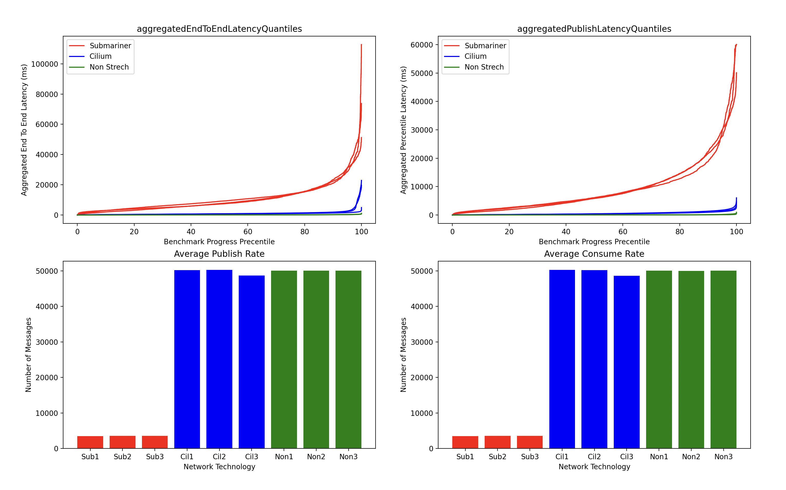

# Performance Testing

## Open messaging benchmark framework
The Open Messaging Benchmark framework was used to benchmark the stretch Kafka clusters. By following this [tutorial](https://community.ibm.com/community/user/integration/blogs/dale-lane1/2025/02/03/running-openmessaging-benchmarks), we obtained benchmark results for three configurations:
 - Regular Kafka cluster
 - Stretch kafka cluster with submariner
 - Stretch kafka cluster using cilium

The Open messaging benchmark framework deploys 8 benchmark workers and one driver to the K8s environment. Once the tests start, the driver employs the workers to produce/consume messages to the cluster using its bootstrap url.

## Configuration
For all the stretched kafka cluster configurations, the OCP/K8s clusters were in the same data centers hence minimizing the network latency and shifting the focus on the additional latency provided by the tools in use.

### Regular Kafka cluster
We have used a regular kraft kafka cluster using 3 brokers and 3 controllers and ephemeral storage. This CR was applied in an OCP environment.
```yaml
apiVersion: kafka.strimzi.io/v1beta2
kind: KafkaNodePool
metadata:
  name: controller
  labels:
    strimzi.io/cluster: my-cluster
spec:
  replicas: 3
  roles:
    - controller
  storage:
    type: jbod
    volumes:
      - id: 0
        type: ephemeral
        kraftMetadata: shared
---

apiVersion: kafka.strimzi.io/v1beta2
kind: KafkaNodePool
metadata:
  name: broker
  labels:
    strimzi.io/cluster: my-cluster
spec:
  replicas: 3
  roles:
    - broker
  storage:
    type: jbod
    volumes:
      - id: 0
        type: ephemeral
        kraftMetadata: shared
---

apiVersion: kafka.strimzi.io/v1beta2
kind: Kafka
metadata:
  name: my-cluster
  annotations:
    strimzi.io/node-pools: enabled
    strimzi.io/kraft: enabled
spec:
  kafka:
    version: 3.8.0
    metadataVersion: 3.8-IV0
    listeners:
      - name: plain
        port: 9092
        type: internal
        tls: false
      - name: tls
        port: 9093
        type: internal
        tls: true
    config:
      offsets.topic.replication.factor: 3
      transaction.state.log.replication.factor: 3
      transaction.state.log.min.isr: 2
      default.replication.factor: 3
      min.insync.replicas: 2
  entityOperator:
    topicOperator: {}
    userOperator: {}
```

### Stretched kafka cluster with submariner
The kafka cluster was deployed in three OCP environment. We havd 3 brokers and 3 controllers in all three OCP clusters. Similar to the regular stretch cluster, we've used ephemeral storage for this configuration. Submariner was deployed on all three clusters and connected using the `subctl` binary.
```yaml
#Central Cluster CR (spec.cluster is missing in these CRs)
#----------------------------------------------------------
apiVersion: kafka.strimzi.io/v1beta2
kind: KafkaNodePool
metadata:
  name: controller
  labels:
    strimzi.io/cluster: my-cluster
    strimzi.io/submariner-cluster-id: "cluster1" #-------> submariner-cluster-id will be used in controller.quorum.voters and advertised.listeners to enable cross cluster communication  
spec:                                            #-------> In addition to this every controller and broker Pods will have a SANS entry with the Submariner exported DNS name                       
  replicas: 3
  roles:
    - controller
  storage:
    type: jbod
    volumes:
      - id: 0
        type: ephemeral
        kraftMetadata: shared
---

apiVersion: kafka.strimzi.io/v1beta2
kind: KafkaNodePool
metadata:
  name: broker
  labels:
    strimzi.io/cluster: my-cluster
    strimzi.io/submariner-cluster-id: "cluster1"
spec:
  replicas: 3
  roles:
    - broker
  storage:
    type: jbod
    volumes:
      - id: 0
        type: ephemeral
        kraftMetadata: shared
---

#Remote Cluster CR (spec.cluster is present and the SPS will be deployed on K8s cluster which we referenced as cluster-a)
#-----------------------------------------------------------------------------------------------------------------------

apiVersion: kafka.strimzi.io/v1beta2
kind: KafkaNodePool
metadata:
  name: stretch1-controller
  labels:
    strimzi.io/cluster: my-cluster
    strimzi.io/submariner-cluster-id: "cluster2"
spec:
  cluster: cluster-a #------->  all resources part of this KNP will be created in K8s cluster-a
  replicas: 3
  roles:
    - controller
  storage:
    type: jbod
    volumes:
      - id: 0
        type: ephemeral
        kraftMetadata: shared
---

apiVersion: kafka.strimzi.io/v1beta2
kind: KafkaNodePool
metadata:
  name: stretch1-broker
  labels:
    strimzi.io/cluster: my-cluster
    strimzi.io/submariner-cluster-id: "cluster2"
spec:
  cluster: cluster-a #------->  all resources part of this KNP will be created in K8s cluster-a
  replicas: 3
  roles:
    - broker
  storage:
    type: jbod
    volumes:
      - id: 0
        type: ephemeral
        kraftMetadata: shared
---

#Remote Cluster CR (spec.cluster is present and the SPS will be deployed on K8s cluster which we referenced as cluster-b)
#-----------------------------------------------------------------------------------------------------------------------

apiVersion: kafka.strimzi.io/v1beta2
kind: KafkaNodePool
metadata:
  name: stretch2-controller
  labels:
    strimzi.io/cluster: my-cluster
    strimzi.io/submariner-cluster-id: "cluster3"
spec:
  cluster: cluster-b  #-------> all resources part of this KNP will be created in K8s cluster-b
  replicas: 3
  roles:
    - controller
  storage:
    type: jbod
    volumes:
      - id: 0
        type: ephemeral
        kraftMetadata: shared
---

apiVersion: kafka.strimzi.io/v1beta2
kind: KafkaNodePool
metadata:
  name: stretch2-broker
  labels:
    strimzi.io/cluster: my-cluster
    strimzi.io/submariner-cluster-id: "cluster3"
spec:
  cluster: cluster-b #-------> all resources part of this KNP will be created in K8s cluster-b
  replicas: 3
  roles:
    - broker
  storage:
    type: jbod
    volumes:
      - id: 0
        type: ephemeral
        kraftMetadata: shared
---


apiVersion: kafka.strimzi.io/v1beta2
kind: Kafka
metadata:
  name: my-cluster
  annotations:
    strimzi.io/node-pools: enabled
    strimzi.io/kraft: enabled
    strimzi.io/cross-cluster-type: "submariner"  #------->  Cross Cluster Communication Technology in use 
spec:
  kafka:
    version: 3.8.0
    metadataVersion: 3.8-IV0
    listeners:
      - name: plain
        port: 9092
        type: internal
        tls: false
      - name: tls
        port: 9093
        type: internal
        tls: true
    config:
      offsets.topic.replication.factor: 3
      transaction.state.log.replication.factor: 3
      transaction.state.log.min.isr: 2
      default.replication.factor: 3
      min.insync.replicas: 2
  entityOperator:
    topicOperator: {}
    userOperator: {}
```

### Stretched kafka cluster with Cilium
Three k8s clusters were connected using the `cilium` cli and then stretch was implemented on this using the exact same CR used for submariner. 3 brokers, 3 controllers on each of the clusters working together to form a stretched kafka cluster using cilium.

## Findings
Three iterations of tests were taken for each environment to avoid any environement related noise from the test results. These results were taken to a json file and plotted using matplotlib. 4 parameters were of signifance to us.
1. Publish Delay (ms)
2. End to end Delay (ms)
3. Publish Rate (messages/sec)
4. Consume Rate (messages/sec)
These results are copied to folders non-stretch, stretch-cilium and stretch-submariner.

The plot for these look something like this:

The three plots for each color represents the plot for 3 iterations for each configurations.

The findings are clear. The stretched kafka cluster with submariner provided too much additional latency to be comparable with the regular kafka cluster while cilium provides comparable levels of performance with the regular kafka cluster.


